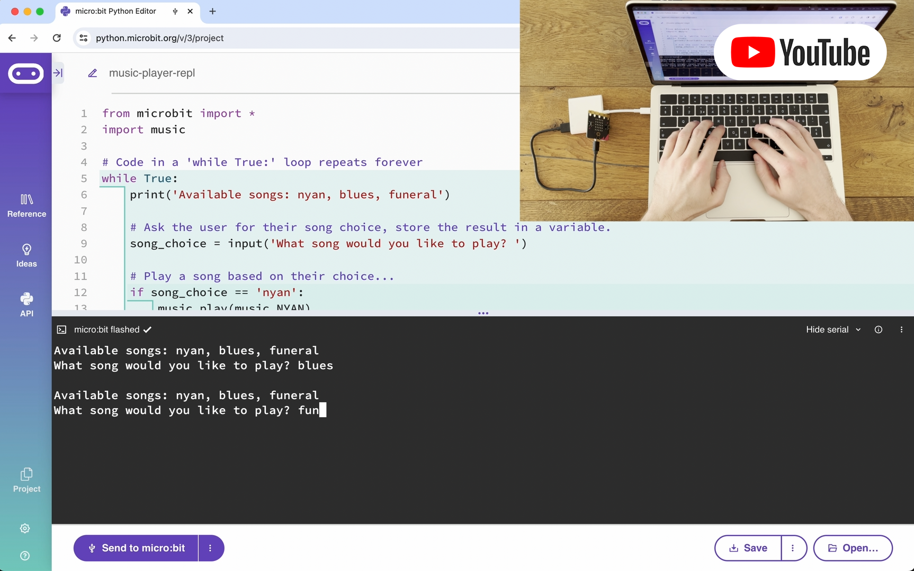

# Knowledge Base Microbit and Maqueen
A central place for projects, ideas, learnings, code snippets, and experiments with Microbit and Maqueen. Unless stated
otherwise, all projects are developed within the [Microbit Python editor](https://python.microbit.org/v/3/project).

## Featured Projects
### Maqueen RC Car
➡️ Check out the [project source](projects/maqueen-rc-car/README.md).
 

### Health Points
 
➡️ Check out the [project source](projects/health-points/README.md).

### Jukebox
 
➡️ Check out the [project source](projects/various/jukebox.py).

## MakeCode Editor
* https://makecode.microbit.org/#editor
* In the background: transpiled to JavaScript
* Switch between block language, JS, and Python
* To use with Maqueen: Settings -> Extensions -> `DFRobot_MaqueenPlus_v20`
* Import / export: `.hex` files, which can also be flashed to Microbit
* Login with Microsoft to save projects

## Python editor
* https://python.microbit.org/v/3/reference/sound
* No cloud save functionality (?)
* Drag & drop API reference

## Maqueen library
https://gbsl-informatik.github.io/maqueen-plus-v2-mpy/docs/

## Learnings
### Program size limitation
There is a limit to how large a Microbit program can be. Once a program exceeds tha limit, the Python editor will fail
when trying to download the `.hex` file. This was for example the case in the `maqueen-rc-car` project, where I ended up
having to remove parts of the `maqueen` library to reduce the code size.
