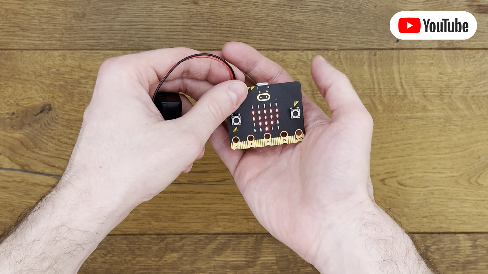

# Health Points
In this project, a heart icon serves as a dynamic health indicator displayed on the Micro:bit's screen. It gracefully
fades away upon impact, complemented by classic retro-style 8-bit sound effects.

