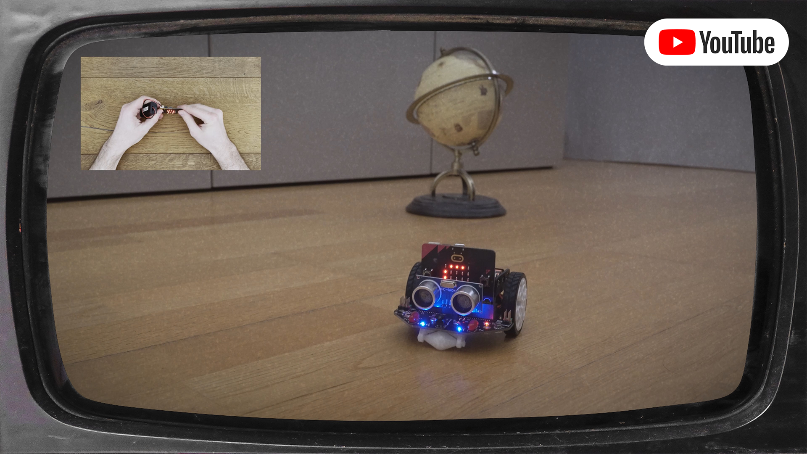
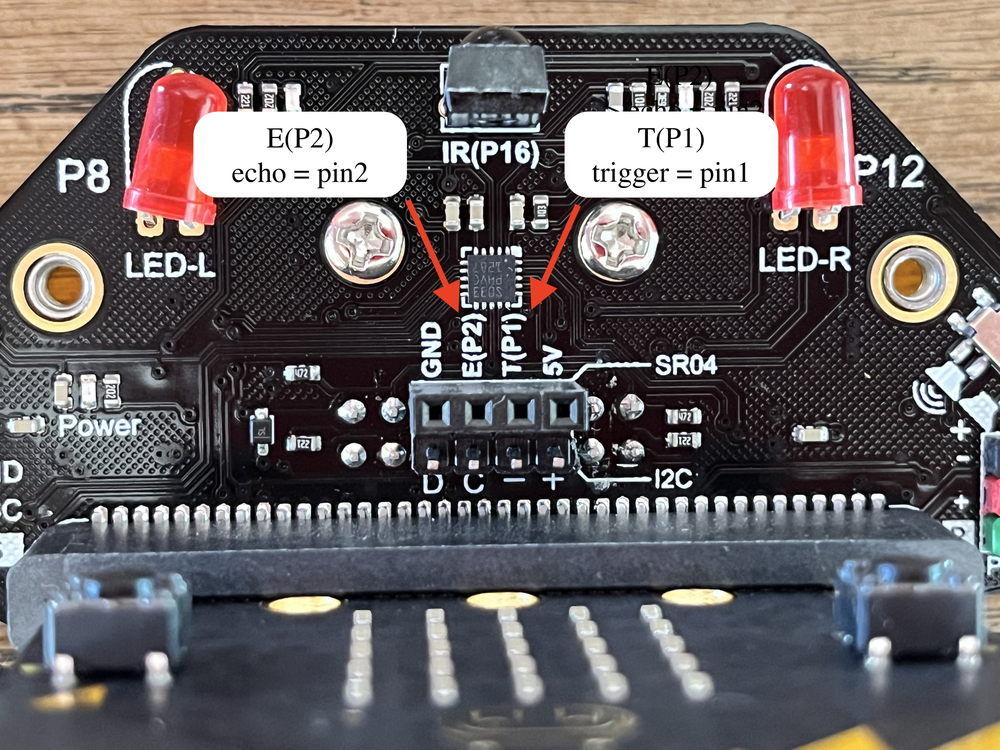
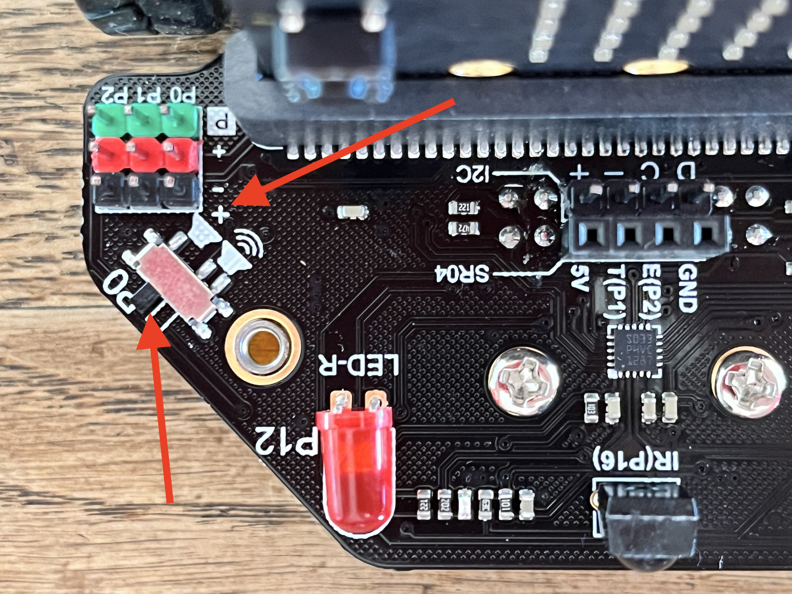

# Maqueen RC Car
This project combines two Micro:bits and a Maqueen robot into an RC car setup with a gyroscopic remote control.

[](https://youtu.be/bEWP7llgGec "Maqueen RC Car Demo")

One Micro:bit acts as a car controller and is installed into the Maqueen robot, while the other one is used as the remote
control. The driver controls the throttle and steers the car by tilting the remote control forward and sideways,
respectively. The car controller receives the remote's speed commands via the radio module and uses them to control 
the speed of Maqueen's two motors. If it detects something having gone wrong, the car controller stops the motors,
enters a failsafe mode, and sounds and alarm.

## Usage
### Installation and setup
- Load the program in the [Python editor](https://python.microbit.org/v/3/project), e.g. by importing the hex file.
- Upload it to **two** Micro:bits.
- Connect one Micro:bit to the Maqueen robot - this Micro:bit is now the _car controller_.
- Turn on the Maqueen robot.
- Use the `A` button on the car controller to set it into `car controller` mode, indicated by a `C` on the screen.
- Connect the other Micro:bit to a battery pack (or leave it plugged into a USB port). This Micro:bit is now the _remote control_.
- Use the `A` button to set the remote control into `remote control: parking` mode, indicated by a `P` on the screen.
  - **Caution:** If the screen is showing a `D` instead of a `P`, press the `B` button once to switch from `driving` into `parking` mode.

### Driving
After completing the installation and setup steps, the Maqueen RC car is now ready for driving.
- Hold the remote control upright, in landscape orientation, with the Micro:bit logo facing toward you. Tilt slightly toward yourself.
- Press the `B` button on the remote to switch from `parking` to `driving` mode, indicated by a `D` on the screen.
- Start tilting the remote control away from yourself to let the Maqueen drive forward. Tilt sideways to steer.

### Failsafe mode
The car controller has a built-in failsafe mode, which is triggered whenever there is a problem. Engaging the failsafe
mode stops all motors and causes all speed update commands to be ignored, until the init routine is run again.

To exit the failsafe mode, use the `B` button on the remote to first switch to `parking` mode (`P`) and then back to
`driving` mode (`D`). 

### Alarms
If something goes wrong, the car controller sounds an alarm, usually indicating that the failsafe mode has been
engaged. This section discusses the possible alarm tones and their meaning.

**System error,** _marked by a siren of six tones in three pairs of tritones_. Think of it as a 5xx-class HTTP status
code: if that happens, blame the developer. Possible reasons could be that the remote sent an unrecognized command, that
a command was interpreted as a speed update but didn't match the required format, or that some other exception has
ocurred.

**Driver error,** _marked by three ascending warning tones_. Think of it as a 4xx-class HTTP status code: if that
happens, blame the driver.

## Troubleshooting
***
**Issue:** _When I press the `A` button on the remote control, it crashes._

**Solution:** This behavior is expected. The Micro:bit tries to start communicating with its Maqueen, as soon as it is
set to `car controller` mode. If it can't find one, it crashes. Disconnect the Micro:bit from its power source and
reconnect it, to resolve the issue.

***
**Issue:** _Obstacle detection is not behaving as expected._

**Remedy:** Obstacle detection is not yet fully stable. For now, it is recommended disable it in `config.py`:
```python
OBSTACLE_DETECTION_ENABLED = False
```

Alternatively, search this section for a specific issue to continue the troubleshooting process with obstacle
detection enabled.

***
**Issue:** _Obstacle detection triggers immediately, as soon as I turn the Micro:bit in to car controller mode._

Upload the changed script to (at least) the car controller Micro:bit and the issue should be fixed.

**Solution:** This is likely due to an incorrect pin configuration for the ultrasonic sensor (assuming that it is
properly connected to Maqueen). First, check the following labels on your Maqueen robot to determine the ultrasonic pins
used in your setup:



Other likely candidates are `pin13` (trigger) and `pin14` (echo). Then, open `car_controller.py` and edit the following
lines in the `car_controller_verify_no_obstacles()` function:
```python
# Get the current distance reading.
distance_cm = ultrasonic(trig = pin1, echo = pin2)
```

Make sure that `car_controller.py` includes the required imports at the top of the file:
```python
from microbit import *  # or 'from microbit import pin1, pin2'
```

Upload the changed script to (at least) the car controller Micro:bit and the issue should be fixed.

***
**Issue:** _Maqueen makes a high-pitched buzzing sound after detecting an obstacle. The car also doesn't react properly
anymore._

**Remedy:** This is a known issue; the root cause is not yet identified. To remedy the issue, turn off Maqueen's own
onboard speaker:



***
